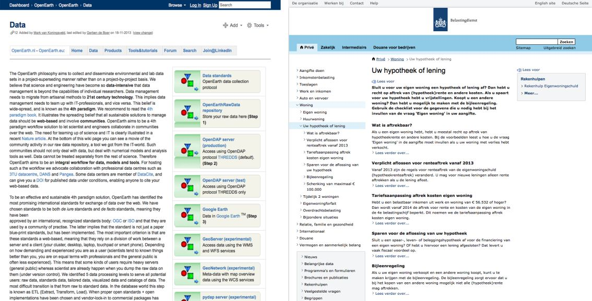

Neem even de tijd en vergelijk onderstaande teksten. Welke tekst leest
fijner?
<figure>

<figcaption>(Bron: Deltares en de Belastingdienst)</figcaption>
</figure>
Ik durf te wedden dat je kiest voor de rechter tekst!

##Het doel van koppen en tussenkoppen
Het doel van koppen en tussenkoppen is het structureren van tekst en
het trekken van aandacht. Ze
stellen lezers in staat om snel in te schatten waar de onderliggende
tekst over gaat en of deze aansluit op hun informatiebehoefte. Kortom,
ze sporen bezoekers aan om het onderliggende bericht wel of niet te
lezen.

##Wat zet je in een (tussen)kop?
Wat je in de kop zet, hangt af van de algehele strekking van de tekst of, in het geval van een tussenkop, de onderliggende alinea. 
Volgens het <a href="http://www.bol.com/nl/p/handboek-webredactie/1001004009905814">
“Handboek Webredactie (2010, 1e druk)"</a> van Geert Poort en
Corona de Wert verwoord een goede kop nieuws, een kernboodschap,
conclusie of een voordeel voor de lezer.

Voorbeelden:

-  **Kop met een voordeel**:  
"Gratis Samsung Galaxy Tab3 bij alle erkende HBO-opleidingen" (www.loi.nl, 9 mei 2014)  
- **Kop met nieuws**:  
"Chauffeurs in actie voor nieuwe CAO"  
(www.nu.nl, 5 mei 2014)  
-  **Kop met een kernboodschap/conclusie**:  
"Appel meest vervuilde fruitsoort"  
(www.nu.nl, 4 mei 2014)

##Do’s and don’ts
Wat moet je laten bij het schrijven van koppen en wat moet je vooral doen?
Het schrijven van koppen is niet lastig, als je je houdt aan de volgende punten:

Wat **niet** te **doen**:

1.	**Jargon of moeilijke woorden gebruiken**. Niet iedere bezoeker is
wellicht bekend met de gebruikte woorden.  
2. **Leestekens gebruiken**. Uitzondering hierop zijn het vraagteken of dubbele punten met aanhalingstekens (citaat).
3.	**Vaak uitroeptekens gebruiken**. Uitroeptekens komen schreeuwerig over. 
4.	**Een kop maken die uit meer dan 1 regel bestaat**. Probeer het bij 2 tot 5 woorden te houden. 
5.	**Creatieve koppen schrijven**. Een kop moet duidelijk maken waar de onderliggende alinea over gaat. Houd de kop daarom zo informatief en eenduidig mogelijk. 

Wat **wel** te **doen**:

1.	**Schrijf koppen in de tegenwoordige of toekomstige tijd**. Hiermee maak je je tekst actueel en aantrekkelijk. 
2.	**Schrijf actief**. Passieve koppen bevatten een vorm van de werkwoorden worden, hebben of zijn. Lezers ervaren passieve
      zinnen als afstandelijker en lastiger leesbaar.  Ook zijn actieve zinnen vaak korter dan passieve zinnen, wat de
      leesbaarheid ten goede komt.

	Vergelijk:
	
	 _"We worden door de manager rondgeleid"_ (passief)  
	 _"De manager leidt ons rond"_ (actief)
	
3.	**Laat tussenkoppen een rode draad vormen**. De bezoeker kan zo in één oogopslag inschatten waar de tekst over gaat. 
4.	**Zet zoekwoorden in de koppen**. Bezoekers zijn op zoek naar informatie die aansluit op hun behoefte. Door kernwoorden aan het begin van een kop (en de eerste zin van de onderliggende alinea) te zetten, kunnen bezoekers inschatten of de tekst antwoord op hun vraag zou kunnen  hebben. Daarnaast verbeter je hiermee de vindbaarheid van de tekst door zoekmachines.

  
Laat weten wat je vindt en laat een reactie achter in de comments!
