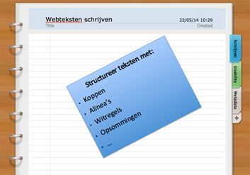

Het leren van eindeloze rijtjes woorden vond ik vroeger verschrikkelijk. Ik kreeg ze er maar moeilijk in. 

Bij het lezen van teksten en het onthouden ervan, had ik juist weer geen moeite met opsommingen. Ik vond ze juist fijn, omdat ik zo sneller kon leren: ze ordenden de tekst.

Ook bij recepten en een boodschappenlijst is het handig om met
opsommingen te werken: je blijft anders zoeken waar je gebleven was.

Vandaag ga ik het hebben over opsommingen in webteksten.

##Waarom gebruik je opsommingen?
Ten eerste gebruik je opsommingen omdat ze extra aandacht trekken. Ze geven structuur aan teksten en maken ze makkelijker leesbaar. 

Ten tweede lijken opsommingen op een compacte samenvatting: ze komen direct tot de kern van de zaak.

Ten derde lezen opsommingen snel en zijn ze ordelijk: dus goed voor de scannende lezer.

Tot slot zijn opsommingen makkelijk te onthouden, zeker als het gaat om een verkopende tekst waarin je voordelen voor de lezer opsomt.

##Opsommingen: de regels
Net als koppen en alinea’s gelden bij het gebruik van bullets of
opsommingen regels, waarmee de scannende lezer een webtekst efficient
kan lezen. Hier komen ze:

- _Beperk je tot maximaal 3 tot 5 punten_. Gebruik je meer dan dit,
  dan kunnen lezers punten gemakkelijk overslaan.  
- _Houdt elke zin op 1 regel_. Zet je alle punten namelijk achter
  elkaar in een lange zin, dan leest dit een stuk lastiger.  
- _Gebruik niet te veel opsommingen in je tekst_. Lezers ervaren
  opsommingen als belangrijk, omdat ze een samenvattende functie
  hebben. Gebruik je echter te veel opsommingen, dan gaat dit effect
  verloren. Denk aan het leren van rijtjes woorden!

##Welke informatie zet je in opsommingen?
In opsommingen kun je verschillende soorten informatie kwijt. In
webteksten ga je uit van de wensen en behoeften van de lezer. Kies
daarom bij het gebruik van opsommingen dus voor:

- Voordelen  
- Oplossingen  
- Kernpunten  
of  
- Resultaten

##Bullets of cijfers?
Gebruik bullets als de volgorde van de opsomming niet belangrijk is. 
Is de volgorde wel belangrijk? Gebruik dan cijfers.

Reageren? Laat een comment achter!
  
