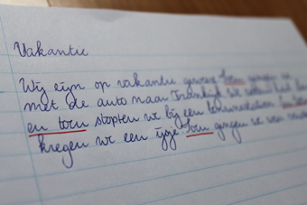

Na de zomervakanties kwamen mijn zus en ik terug op de basisschool en mochten wij samen met onze medeleerlingen onze belevenissen
opschrijven. Misschien herken je het nog van jezelf, je klasgenoten van toen of van je eigen kinderen: elk verhaal bevatte een behoorlijk
“en toen” gehalte.

Met deze woorden gaven wij onze juf of meester het signaal dat de door
ons beschreven gebeurtenissen zich in een chronologische volgorde
afspeelden.

Nu we ouder zijn, gebruiken we ook nog signaalwoorden in teksten en
zijn zij (hopelijk) een stuk gevarieerder.

Maar wat zijn signaalwoorden en wat kunnen ze voor je lezer betekenen? 
Dat probeer ik vandaag uit te leggen.

##Signaalwoorden verbinden
Signaalwoorden geven structuur aan een webtekst en maken een tekst
scanbaar. Net als koppen, alinea’s, opsommingen en witregels. Een
ander woord voor signaalwoorden is “verbindingswoorden”: ze verbinden
zinnen, alinea’s en zinsdelen met elkaar.

##Welke verbanden zijn er?
Signaalwoorden geven de lezer een seintje welke verbanden we tussen de
verschillende zinnen of alinea’s kunnen verwachten. Zo weet je dat het
woord “maar”  een **tegenstelling** aankondigt en dat er na “dus” een
**conclusie** komt.

Een conclusie en een tegenstelling zijn slechts twee mogelijke
verbanden die je als lezer tegenkomt. Andere veel voorkomende
verbanden zijn:  
- _Opsomming_: ten eerste, ook, bovendien  
- **Tijd**: eerst, daarna, vroeger  
- **Oorzaak/gevolg**: daardoor, doordat  
- **Voorbeeld of toelichting**: bijvoorbeeld, zoals  
- **Voorwaarde**: indien, als, mits  
- **Doel/middel**: door middel van, met als doel  
- **Samenvatting**: kortom, al met al  
- **Reden/verklaring**: want, omdat, namelijk  
- **Vergelijking**: net als, zoals

##Signaalwoorden in webteksten: conclusie
Webbezoekers gaan haastig te werk en scannen pagina’s af, op zoek naar
relevante informatie. Tijd om zelf verbanden tussen zinnen of
tekstdelen te leggen, hebben zij dus niet. Door gebruik te maken van
signaalwoorden in je webteksten, help je de lezer deze verbanden te
leggen en zullen zij jouw tekst sneller begrijpen!

  
Laat je reactie achter!
  

<small>Bronnen:  
<a href="http://www.taalislol.classy.be/signaalwoorden.htm">www.taalislol.classy.be</a>  
<a href="http://www.slideshare.net/Sanderling/signaalwoorden-25876361">www.slideshare.net</a>  
<a href="http://puntann.nl/category/webtekst-schrijven/">puntann.nl</a>
</small>

